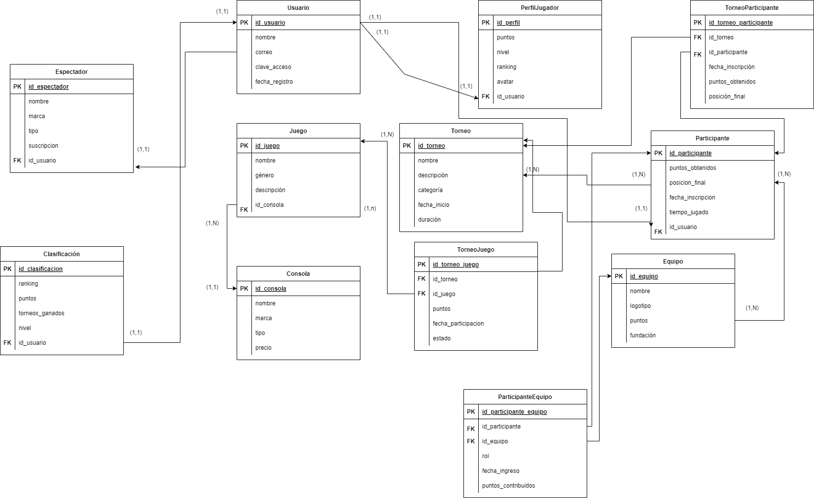

# Proyecto de Aplicación Web de Torneos de Videojuegos

## Descripción
Este proyecto es una aplicación web diseñada para gestionar torneos de videojuegos, donde los usuarios pueden registrarse, participar en torneos y seguir su progreso a través de clasificaciones y perfiles de jugador.
La aplicación será una plataforma donde los usuarios pueden organizar y participar en torneos de videojuegos. En este espacio, los jugadores tendrán la oportunidad de crear sus propios torneos en distintas categorías, como deportes, estrategia o acción, y así invitar a otros a unirse. Cada usuario tendrá su perfil personal, donde podrán ver sus estadísticas, historial de participación y logros obtenidos en los torneos. Además, se incluirá una tabla de clasificación que mostrará a los mejores jugadores de cada torneo, fomentando un ambiente competitivo y colaborativo. Todo esto busca ofrecer una experiencia completa y divertida para los amantes de los videojuegos, permitiendo que se conecten y compitan entre sí de manera fácil y accesible.

## Modelos
### 1. Usuario
- **nombre**: `CharField(max_length=200)` - Nombre del usuario.
- **correo**: `EmailField(max_length=200)` - Correo electrónico del usuario.
- **clave_de_acceso**: `CharField(max_length=200)` - Clave de acceso del usuario.
- **fecha_registro**: `DateTimeField(blank=True, null=True)` - Fecha y hora de registro del usuario.

### 2. PerfilDeJugador
- **usuario**: `OneToOneField(Usuario)` - Relación uno a uno con el modelo Usuario.
- **puntos**: `IntegerField(default=0)` - Puntos acumulados por el jugador.
- **nivel**: `IntegerField(default=0)` - Nivel del jugador.
- **ranking**: `IntegerField(default=0)` - Ranking del jugador en la clasificación.
- **avatar**: `URLField(max_length=200)` - URL del avatar del jugador.

### 3. Equipo
- **nombre**: `CharField(max_length=200)` - Nombre del equipo.
- **logotipo**: `URLField(max_length=200, blank=True, null=True)` - URL del logotipo del equipo.
- **fecha_ingreso**: `DateField(default=timezone.now)` - Fecha de ingreso del equipo.
- **puntos_contribuidos**: `IntegerField(default=0)` - Puntos que el equipo ha contribuido.

### 4. Participante
- **usuario**: `OneToOneField(Usuario)` - Relación uno a uno con el modelo Usuario.
- **puntos_obtenidos**: `IntegerField(default=0)` - Puntos obtenidos por el participante.
- **posicion_final**: `IntegerField(default=0)` - Posición final en el torneo.
- **fecha_inscripcion**: `DateField(default=timezone.now)` - Fecha de inscripción al torneo.
- **tiempo_jugado**: `FloatField` - Tiempo jugado por el participante.
- **equipos**: `ManyToManyField(Equipo)` - Relación muchos a muchos con el modelo Equipo a través de 'ParticipanteEquipo'.

### 5. Torneo
- **nombre**: `CharField(max_length=200)` - Nombre del torneo.
- **descripcion**: `TextField` - Descripción del torneo.
- **categoria**: `CharField(max_length=100)` - Categoría del torneo.
- **duracion**: `DurationField` - Duración del torneo.
- **fecha_inicio**: `DateField(default=timezone.now)` - Fecha de inicio del torneo.
- **participantes**: `ManyToManyField(Participante)` - Relación muchos a muchos con el modelo Participante a través de 'TorneoParticipante'.

### 6. Consola
- **nombre**: `CharField(max_length=200)` - Nombre de la consola.
- **marca**: `CharField(max_length=100)` - Marca de la consola.
- **tipo**: `CharField(max_length=100)` - Tipo de consola.
- **precio**: `DecimalField(max_digits=10, decimal_places=2)` - Precio de la consola.

### 7. Juego
- **torneo**: `ForeignKey(Torneo)` - Relación muchos a uno con el modelo Torneo.
- **nombre**: `CharField(max_length=200)` - Nombre del juego.
- **genero**: `CharField(max_length=50)` - Género del juego.
- **id_consola**: `ForeignKey(Consola)` - Relación muchos a uno con el modelo Consola.
- **descripcion**: `TextField` - Descripción del juego.
- **torneos**: `ManyToManyField(Torneo)` - Relación muchos a muchos con el modelo Torneo a través de 'TorneoJuego'.

### 8. Espectador
- **usuario**: `OneToOneField(Usuario)` - Relación uno a uno con el modelo Usuario.
- **nivel_interes**: `IntegerField(default=0)` - Nivel de interés del espectador.
- **comentarios**: `TextField` - Comentarios del espectador.
- **frecuencia_visitas**: `IntegerField` - Frecuencia de visitas al sitio.
- **suscripcion**: `BooleanField(default=False)` - Indica si el espectador está suscrito.

### 9. Clasificacion
- **usuario**: `OneToOneField(Usuario)` - Relación uno a uno con el modelo Usuario.
- **ranking**: `IntegerField(default=0)` - Ranking del usuario.
- **puntos**: `IntegerField(default=0)` - Puntos acumulados por el usuario.
- **torneos_ganados**: `IntegerField(default=0)` - Cantidad de torneos ganados.

### 10. ParticipanteEquipo
- **participante**: `ForeignKey(Participante)` - Relación muchos a uno con el modelo Participante.
- **equipo**: `ForeignKey(Equipo)` - Relación muchos a uno con el modelo Equipo.
- **rol**: `CharField(max_length=100)` - Rol del participante en el equipo.
- **fecha_ingreso**: `DateField(default=timezone.now)` - Fecha de ingreso al equipo.
- **puntos_contribuidos**: `IntegerField(default=0)` - Puntos que el participante ha contribuido al equipo.
- **tiempo_jugado**: `FloatField(default=0.0)` - Tiempo jugado por el participante en el equipo.

### 11. TorneoJuego
- **torneo**: `ForeignKey(Torneo)` - Relación muchos a uno con el modelo Torneo.
- **juego**: `ForeignKey(Juego)` - Relación muchos a uno con el modelo Juego.
- **puntos**: `IntegerField(default=0)` - Puntos obtenidos en el torneo.
- **fecha_participacion**: `DateField(default=timezone.now)` - Fecha de participación en el torneo.
- **estado**: `CharField(max_length=50, default='activo')` - Estado del torneo, con opciones de 'activo', 'completado', 'pendiente'.

### 12. TorneoParticipante
- **torneo**: `ForeignKey(Torneo)` - Relación muchos a uno con el modelo Torneo.
- **participante**: `ForeignKey(Participante)` - Relación muchos a uno con el modelo Participante.
- **fecha_inscripcion**: `DateField(default=timezone.now)` - Fecha de inscripción al torneo.
- **puntos_obtenidos**: `IntegerField(default=0)` - Puntos obtenidos en el torneo.
- **posicion_final**: `IntegerField(default=0)` - Posición final en el torneo.

## Modelo Entidad-Relación

